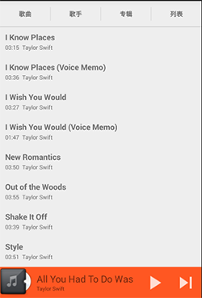
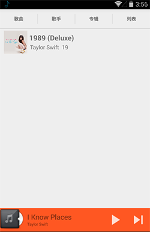
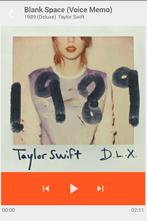

__项目正在重构，大家可以 star 但是先不要 clone 下来看代码啦~~~__

米波音乐播放器
=============

这是一款Android音乐播放器，基于Android的原生的MediaPlayer, 使用Android Studio开发。

要求
-------

- Android SDK 23
- Gradle 3.1.2

开始
---

可以使用 "gradlew build" 命令或者在Android Studio中 "Import Project" 自动构建项目。

截图
---

支持
----

ViewPager切换的部分使用[PagerSlidingTabStrip](https://github.com/astuetz/PagerSlidingTabStrip)

获取专辑封面部分代码采用网络上的一篇博客上面的代码[http://blog.csdn.net/wwj_748/article/details/9237561](http://blog.csdn.net/wwj_748/article/details/9237561)

如果发现我的项目有什么不足或者可以改进的地方，请给我提意见
[https://github.com/MaybeMercy/miplayer/issues](https://github.com/MaybeMercy/miplayer/issues)

许可
---

Copyright 2014 The Android Open Source Project, Inc.

Licensed to the Apache Software Foundation (ASF) under one or more contributor
license agreements.  See the NOTICE file distributed with this work for
additional information regarding copyright ownership.  The ASF licenses this
file to you under the Apache License, Version 2.0 (the "License"); you may not
use this file except in compliance with the License.  You may obtain a copy of
the License at

  http://www.apache.org/licenses/LICENSE-2.0

Unless required by applicable law or agreed to in writing, software
distributed under the License is distributed on an "AS IS" BASIS, WITHOUT
WARRANTIES OR CONDITIONS OF ANY KIND, either express or implied.  See the
License for the specific language governing permissions and limitations under
the License.
